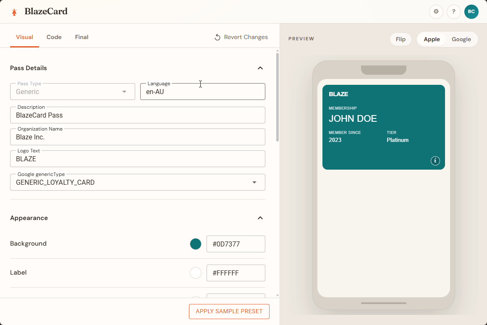
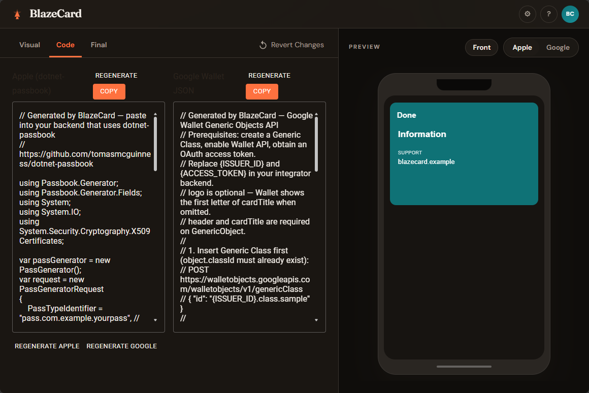
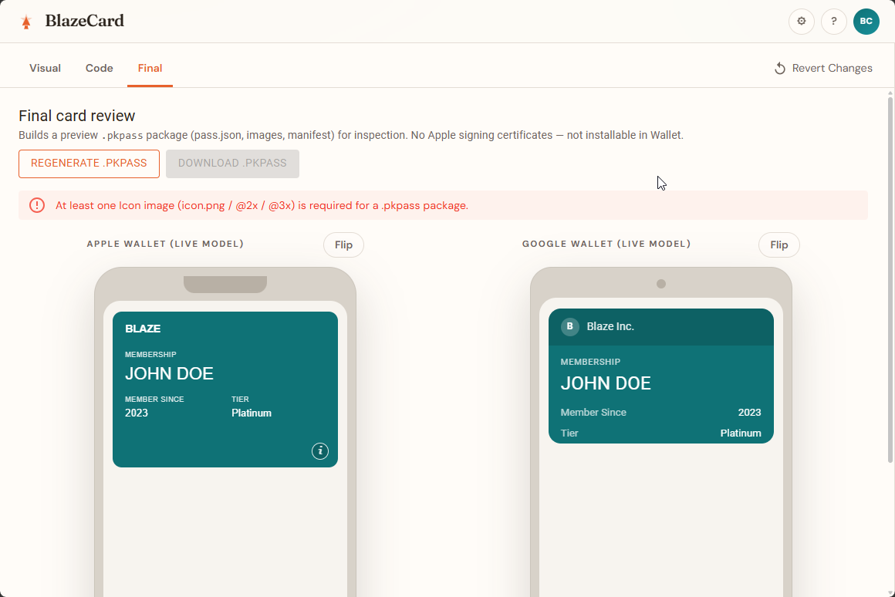

# BlazeCard

**Burn those plastic cards.** Design Apple Wallet and Google Wallet generic passes in the browser, preview them live, and copy paste-ready backend snippets — without wrestling certificates just to see if the layout works.



## Screenshots

**Visual** — structured form beside a live Apple or Google phone preview. **Flip** shows back fields.


**Code** — pasteable [dotnet-passbook](https://github.com/tomasmcguinness/dotnet-passbook) C# and Google Wallet JSON. Edit either side; the model and preview follow. Dark appearance shown, pass flipped to the back.



**Final** — inspect a preview `.pkpass` package and both live models (Apple and Google).



## Why

Wallet passes are awkward to iterate on: Apple wants a signed `.pkpass`, Google wants HTTPS image URLs and JSON envelopes, and the feedback loop is slow. BlazeCard is a **previewer + code exporter** for generic passes so you can:

- Shape fields, colours, barcodes, and images against a live phone preview
- Emit real **dotnet-passbook** C# and Google Wallet JSON for your integrator backend
- Inspect a **preview `.pkpass` package** (structure only — not Wallet-installable) before you wire signing in production

It does **not** replace your Apple Developer certificates or Google issuer setup. Those stay in your backend.

## Features

| Area | What you get |
|------|----------------|
| **Visual** | Form editor for pass details, appearance, Apple `PassbookImage` slots (1×/2×/3×), Google hero / wide logo / image module, fields, barcode |
| **Code** | Two-way sync for Apple (dotnet-passbook) and Google Wallet snippets — edit either side, model + preview update |
| **Final** | Builds a preview `.pkpass`-shaped zip (`pass.json`, images, `manifest.json`) for package inspection |
| **Live preview** | Apple / Google phone frames; **Flip** to see back fields |
| **Appearance** | Light and dark |
| **Sample preset** | One-click starter membership pass |
| **Session restore** | Autosaves non-image state to `localStorage` (images stay in-session only) |

## Quick start (Docker Compose)

Requires [Docker](https://docs.docker.com/get-docker/) with Compose.

```bash
docker compose up --build
```

Open **http://localhost:570**

Stop:

```bash
docker compose down
```

Rebuild after UI/asset changes:

```bash
docker compose up --build -d
```

Health check: `GET http://localhost:570/health`

### Ports

| Host | Container | Service |
|------|-----------|---------|
| `570` | `570` | BlazeCard (ASP.NET) |

## Run without Docker

```bash
dotnet run --project BlazeCard
```

Defaults to **http://localhost:570** (`Properties/launchSettings.json`).

```bash
dotnet test
```

## Final tab notes

1. Upload at least one **Icon** (Apple Passbook image) in Visual.
2. Open **Final** → review packaged assets and `pass.json`.
3. Optional: download the preview zip for offline inspection.

Preview mode is on by default (`BlazeCard:PkPass:UsePreviewCertificates=true`). That package is **not** signed for Apple Wallet. Real Pass Type ID + WWDR signing belongs in your production integrator, not this tool’s default path.

## Stack

- .NET 9 / Blazor Server  
- MudBlazor  
- [dotnet-passbook](https://github.com/tomasmcguinness/dotnet-passbook) (types + sample generation; preview packaging for Final)
